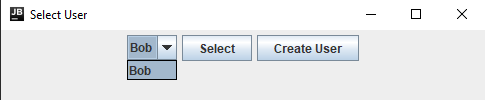
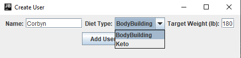
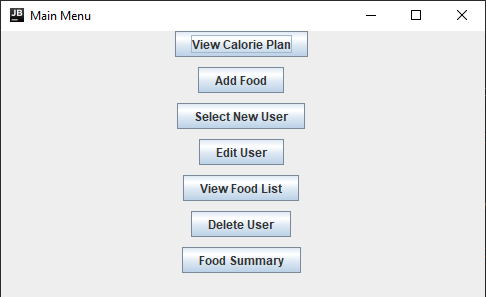
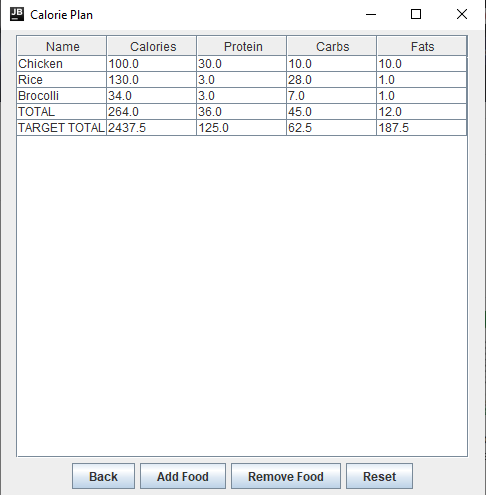
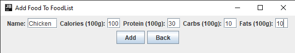
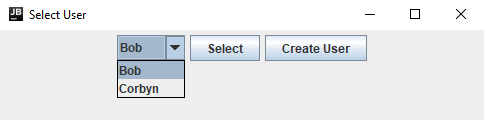
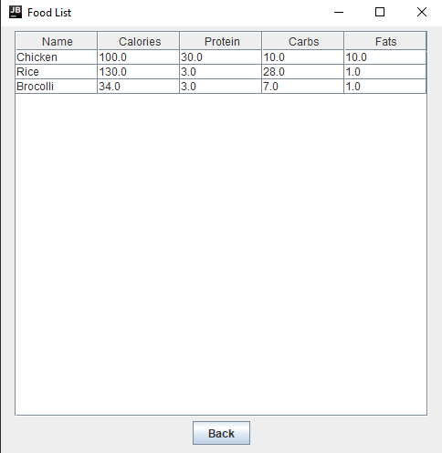
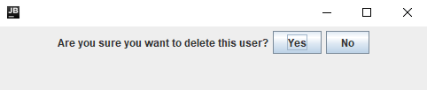
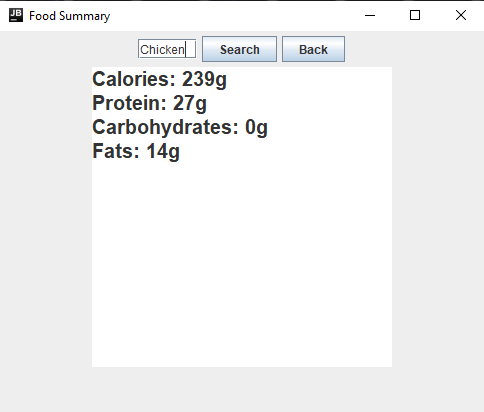

# Calorie Tracker

### Table of Contents

- [Description](#description)
- [How To Use](#how-to-use)
    - [Opening the Java Application](#Opening-the-Java-Application)
    - [Select User](#Select-User)
    - [Create User](#Create-User)
    - [Main Menu](#Main-Menu)
    - [View Calorie Plan](#View-Calorie-Plan)
    - [Add Food](#Add-Food)
    - [Select New User](#Select-New-User)
    - [Edit User](#Edit-User)
    - [Delete User](#Delete-User)
    - [Food Summary](#Food-Summary)

- [My Information](#My-Information)

---

## Description

As an avid bodybuilder, I've always wanted to track my calories without having to pay absurd monthly fees to websites such as MyFitnessPal and Cronometer therefore I decided to make one myself!  

#### Technologies

- Java
- JSwing
- JUnit

#### Packages I think are important

- `out\production\CalorieTracker\model`
- `out\production\CalorieTracker\ui`
- `out\test`

[Back To The Top](#4Hour-Fruit-Shop-Website-Coding-Challenge)

---
## How To Use

### Opening the Java Application

Download the repository, and go to the following path: `\out\artifacts\CalorieTracker_jar\CalorieTracker.jar` then double click on that file. Alternatively you can open this project in a Java supported IDE, and compile `out\production\CalorieTracker\ui\Main.class`. Once you open the Java application, you should see a UI like this:

### Select User 

Here, you can create a new user clicking **Create User**, and you will see the following UI: 

### Create User

Here, you can enter your name, diet type, and target weight which will be used to calculate your recommended macronutrient intake later. 

Now that you have created a user, select the user and you will be directed to the **Main Menu** 

### Main Menu

Here, you have several options to pick from. I will explain what each menu item does starting from the top

### View Calorie Plan

Users can see their macronutrients target, and add food to meet those targets. 

### Add Food

Add a food's macronutrient values to the Food List. 

### Select new User

Allows a user to select another user or to created a new one. 

### Edit user

User can view the food they added. 

### Delete User

User can choose to delete their account. 

### Food Summary

User can input a food, and get a macronutrient summary of it.

## My Information

 

[Back To The Top](#4Hour-Fruit-Shop-Website-Coding-Challenge)
